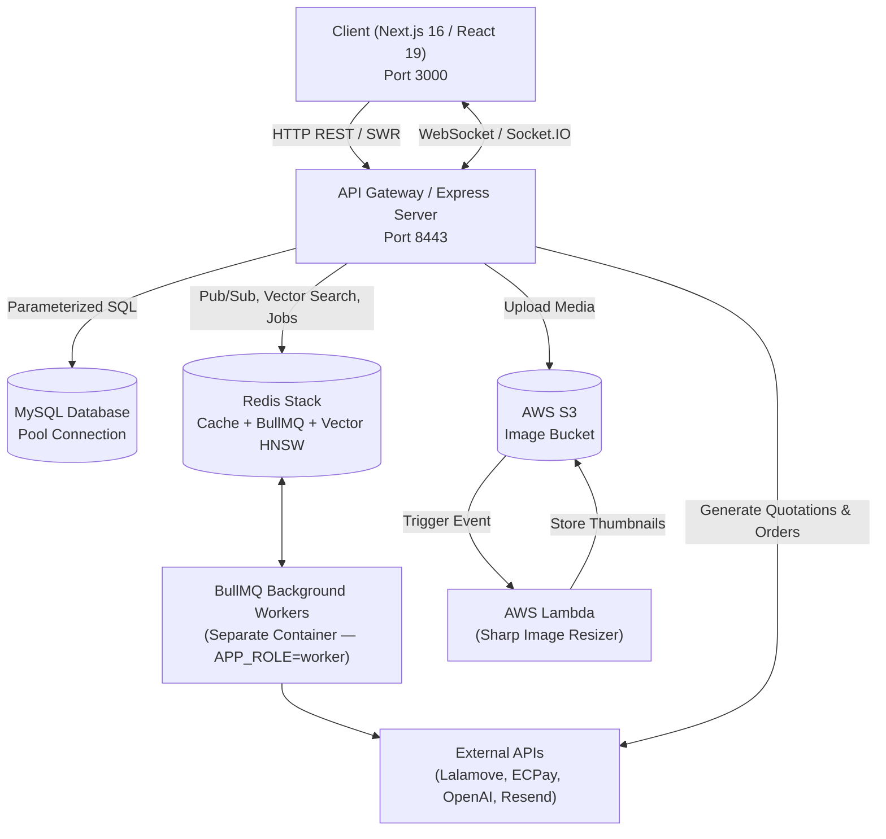

# Megaweave — Senior Engineer Onboarding

> **Audience:** Senior engineer  
> **Generated:** 2026-09-16  
> **Codebase:** `/Users/zhangjunhao/Desktop/Git-repos/Megaweave`

---

## Overview

**Megaweave** is a community-driven resource-sharing platform originally created as a Facebook group and now transformed into a searchable, full-stack web application. It connects communities and individuals to facilitate the free and sustainable circulation of idle goods, featuring an AI-assisted recommendation feed, real-time messaging, logistics dispatch via Lalamove, and payment processing via ECPay.

---

## Architecture

### System Diagram

```
Browser / Mobile PWA
        │
        v (HTTPS :3000)
┌────────────────────────────────────┐
│  Frontend — Next.js 16 App Router  │
│  (React 19 + Tailwind + SWR)       │
│  client/                            │
│    app/         ← file-based routes │
│    components/  ← shadcn/radix-ui  │
│    hooks/       ← SWR + Socket.IO  │
│    services/    ← API fetch layer  │
└────────────────────┬───────────────┘
                     │ HTTPS + Cookie session
                     v (:8443)
┌────────────────────────────────────────────────────────┐
│  Backend — Express 4 (TypeScript)                       │
│  server/src/                                            │
│    server.ts       ← entry point, wires all middleware │
│    api.ts          ← root router (20 sub-routers)      │
│    middleware/auth.ts ← requireAuth / optionalAuth     │
│    session.ts      ← cookie-based session (Redis)      │
│    services/       ← feedService, postService, …       │
│    queue/          ← BullMQ producers + workers        │
│    utils/          ← db, redis, socket, notifications  │
└──┬─────────────┬──────────────┬─────────────────────────┘
   │             │              │
   v             v              v
MySQL 8       Redis Stack    AWS S3 + CloudFront
(raw mysql2)  (session cache, (images & avatars,
 connection    vector index,   CDN: assets.megaweaving.net)
 pool 20)      BullMQ queues,
               Socket.IO adapter)

Background Workers (BullMQ — separate container via APP_ROLE=worker)
  post-image      ← S3 upload / delete (retries: 5, exp backoff)
  email           ← Resend transactional email (retries: 3)
  post-embedding  ← OpenAI text-embedding → Redis HNSW (concurrency: 2)
  user-vector     ← user preference vector update (concurrency: 5)
  user-vector-flush ← dirty-set write-back to MySQL (cron: 10 min, concurrency: 1)
  hot-score       ← post relevance score recalculation (cron, concurrency: 1)
  delivery-reconcile ← Lalamove webhook gap recovery (cron: 5 min)

External Integrations
  ├── ECPay AIO      ← TWD payment gateway (CheckMacValue AES-256)
  ├── Lalamove       ← on-demand delivery API (OAuth HMAC)
  ├── Google OAuth   ← social login (google-auth-library)
  ├── OpenAI         ← text-embedding-3-small for feed personalisation
  ├── Resend         ← transactional email (react-email templates)
  ├── Sentry         ← error tracking (client + edge + server configs)
  └── AWS Lambda     ← image-resizer (services/image-resizer/index.ts)
                        triggered by S3 events → sharp → WebP thumbnails
```

### Component Diagram



### Tech Stack

| Layer | Technology | Notes |
|-------|-----------|-------|
| Frontend | Next.js 16 + React 19 | App Router, standalone output, Turbopack dev |
| Styling | Tailwind CSS 3 + shadcn/ui + Radix UI | `components.json` tracks shadcn component registry |
| Animation | Framer Motion 12 | Tinder card drag, AnimatePresence |
| State / data | SWR 2 (infinite) | Client-side; no RSC data fetching patterns yet |
| Real-time | Socket.IO 4 (client ↔ server) | Redis adapter scales horizontally |
| Backend | Express 4 + TypeScript | Raw HTTP; no framework abstractions beyond express |
| Auth | Cookie-based session stored in Redis | No JWT; `session-id` + `user-role` cookies; `requireAuth` / `optionalAuth` middleware |
| Database | MySQL 8 via `mysql2` promise pool | **No ORM / no migration runner** — raw SQL throughout |
| Cache / Vector DB | Redis Stack (redis/redis-stack docker image) | RediSearch HNSW index `idx:posts_v`, BullMQ queues, Socket.IO pub/sub, session storage |
| Queue | BullMQ 6 | Workers run in a **separate container** (`APP_ROLE=worker`); inline mode available via `RUN_WORKERS_INLINE=true` |
| Object storage | AWS S3 + CloudFront | Uploads via `multer-s3`; thumbnails via Lambda |
| Payment | ECPay AIO | CheckMacValue computed with AES-256 + HMAC-SHA256 |
| Delivery | Lalamove JS SDK | HMAC auth; webhook reconciliation via BullMQ cron |
| Email | Resend + react-email | Templates rendered server-side with React 19 |
| Monitoring | Sentry (nextjs SDK 10) | Source maps uploaded in CI; `tunnelRoute=/monitoring` |
| CI/CD | GitHub Actions | 1 workflow (path unknown — not in `.github/workflows/*.yml`); images pushed to GHCR |
| Deployment | Docker Compose | `docker-compose.yml` for prod; `docker-compose.dev.yml` for local Redis only |
| Infra micro-service | AWS Lambda (TypeScript) | `services/image-resizer/` — S3-triggered thumbnail generator |

---

## Architecture Decision Records

> [!NOTE]
> No formal ADR directory found. The decisions below are inferred from code and commit history. Consider backfilling into `docs/adr/`.

| Decision | Rationale (inferred) | Trade-off |
|----------|---------------------|-----------|
| Raw `mysql2` instead of an ORM | Full SQL control, no abstraction overhead | No migration runner; schema drift risk; table structure lives only in DB |
| Cookie sessions in Redis (no JWT) | Instant revocation; simpler token rotation | Stateful; Redis must be healthy for every authenticated request |
| BullMQ workers in a separate container (`APP_ROLE=worker`) | Isolates worker CPU/memory from HTTP traffic; scales independently | Two containers to deploy and monitor; `RUN_WORKERS_INLINE=true` available for dev convenience |
| Redis Stack for vector search | Avoids a separate vector DB (Pinecone/Weaviate) | Redis Stack is heavier; HNSW rebuild needed on data loss |
| Next.js middleware currently bypassed | Auth is under construction (`return NextResponse.next()` at line 6 of `middleware.ts`) | **All routes are publicly accessible** until this is re-enabled |
| ECPay AIO (not ECPG/站內付) | Broadest payment method support in TW | Redirect-based flow; more complex webhook reconciliation than in-page pay |
| Terraform manages CDN/DNS only | CloudFront, S3 buckets, ACM cert, Route 53 records managed as code; EC2 provisioned manually | Partial IaC; EC2 drift possible without Terraform |

---

## Key File Map

Priority files — read these first:

| Priority | Path | What it does | When to read |
|----------|------|-------------|--------------|
| 1 | [`server/src/server.ts`](file:///Users/zhangjunhao/Desktop/Git-repos/Megaweave/server/src/server.ts) | Entry point: wires Redis, Socket.IO, BullMQ workers (inline if `RUN_WORKERS_INLINE=true`), rate limiter, CORS, HTTPS/HTTP toggle, graceful shutdown | Day 1 |
| 2 | [`server/src/api.ts`](file:///Users/zhangjunhao/Desktop/Git-repos/Megaweave/server/src/api.ts) | Root router — complete list of 20 API domains mounted under `/api` | Day 1 |
| 3 | [`server/src/schema.ts`](file:///Users/zhangjunhao/Desktop/Git-repos/Megaweave/server/src/schema.ts) | Zod schemas for session/user; `UserSession` type used across all auth-protected handlers | Day 1 |
| 4 | [`server/src/middleware/auth.ts`](file:///Users/zhangjunhao/Desktop/Git-repos/Megaweave/server/src/middleware/auth.ts) | `requireAuth` / `optionalAuth` middleware — attaches `req.user: UserSession` | Day 1 |
| 5 | [`server/src/utils/db.ts`](file:///Users/zhangjunhao/Desktop/Git-repos/Megaweave/server/src/utils/db.ts) | MySQL pool (limit 20); pool-pressure monitor logs at ≥18 connections; `closeDatabase()` | Day 1 |
| 6 | [`server/src/utils/redis.ts`](file:///Users/zhangjunhao/Desktop/Git-repos/Megaweave/server/src/utils/redis.ts) | Singleton Redis client; exponential reconnect (max 10 retries); `connectRedis`, `getRedisClient` | Day 1 |
| 7 | [`server/src/services/feedService.ts`](file:///Users/zhangjunhao/Desktop/Git-repos/Megaweave/server/src/services/feedService.ts) | Core recommendation engine: four-path routing, two-stage retrieval (Redis HNSW KNN + MySQL late-materialisation), geo-boost, hybrid re-ranking, cold-start fallback | Week 1 |
| 8 | [`server/src/queue/workers.ts`](file:///Users/zhangjunhao/Desktop/Git-repos/Megaweave/server/src/queue/workers.ts) | Registers all BullMQ workers; wires cron jobs (`initHotScoreCron`, `initUserVectorFlushCron`, `initDeliveryReconcileCron`); entry point when `APP_ROLE=worker` | Week 1 |
| 9 | [`server/src/queue/queues.ts`](file:///Users/zhangjunhao/Desktop/Git-repos/Megaweave/server/src/queue/queues.ts) | Queue instances + enqueue helpers used by route handlers | Week 1 |
| 10 | [`server/src/services/vectorIndexService.ts`](file:///Users/zhangjunhao/Desktop/Git-repos/Megaweave/server/src/services/vectorIndexService.ts) | Idempotent creation of `idx:posts_v` HNSW index (DIM 1536, COSINE) at server start | Week 1 |
| 11 | [`server/src/services/payment/ecpay/ECPayAioProvider.ts`](file:///Users/zhangjunhao/Desktop/Git-repos/Megaweave/server/src/services/payment/ecpay/ECPayAioProvider.ts) | ECPay AIO payment provider; CheckMacValue generation / verification | Week 1 |
| 12 | [`server/src/services/lalamove.ts`](file:///Users/zhangjunhao/Desktop/Git-repos/Megaweave/server/src/services/lalamove.ts) | Lalamove service layer: quotation, order creation, cancellation, status sync | Week 1 |
| 13 | [`client/middleware.ts`](file:///Users/zhangjunhao/Desktop/Git-repos/Megaweave/client/middleware.ts) | ⚠️ Currently disabled (early return on line 6). Contains role-based access logic targeting `admin`/`contributor` — **needs re-enabling before launch** | Week 1 |
| 14 | [`client/next.config.ts`](file:///Users/zhangjunhao/Desktop/Git-repos/Megaweave/client/next.config.ts) | Sentry integration, standalone output, CloudFront image domains, Turbopack, `removeConsole` in prod | Day 1 |
| 15 | [`client/app/contexts/`](file:///Users/zhangjunhao/Desktop/Git-repos/Megaweave/client/app/contexts) | 8 React contexts: `UserContext`, `SocketContext`, `PostContext`, `NotificationContext`, `NavBarContext`, `LocationContext`, `ChatPopupContext`, `TeamContext` — global state backbone | Week 1 |
| 16 | [`client/hooks/useChat.ts`](file:///Users/zhangjunhao/Desktop/Git-repos/Megaweave/client/hooks/useChat.ts) | Largest client file (398 lines) — WebSocket chat hook, message state, read receipts | Week 2 |
| 17 | [`client/utils/tinderAlgorithm.ts`](file:///Users/zhangjunhao/Desktop/Git-repos/Megaweave/client/utils/tinderAlgorithm.ts) | Client-side Tinder card scoring (Gaussian distance decay, recency, hotness) — mirrors backend `feedService` | Week 2 |
| 18 | [`services/image-resizer/index.ts`](file:///Users/zhangjunhao/Desktop/Git-repos/Megaweave/services/image-resizer/index.ts) | AWS Lambda handler: S3-event-triggered WebP thumbnail generation (thumb: 300px, medium: 800px) using Sharp | Week 2 |
| 19 | [`docker-compose.yml`](file:///Users/zhangjunhao/Desktop/Git-repos/Megaweave/docker-compose.yml) | Production topology: Redis Stack, backend (:8443), worker container (`APP_ROLE=worker`), frontend (:3000), Workbench (:9999) — all on `megaweave-net` bridge | Day 1 |
| 20 | [`docker-compose.dev.yml`](file:///Users/zhangjunhao/Desktop/Git-repos/Megaweave/docker-compose.dev.yml) | Dev: Redis Stack only (binds to `0.0.0.0:6379` — **no password** in dev) | Day 1 |

### Dangerous Files — Coordinate Before Modifying

| Path | Risk | Required Coordination |
|------|------|-----------------------|
| `server/src/utils/db.ts` | Pool size / timeout changes affect all routes under load | Test under synthetic load; review with team |
| `server/src/utils/redis.ts` | Reconnect strategy change can cause cascading Socket.IO + BullMQ failures | Stage first; validate with Redis Insight (:8001) |
| `server/src/services/feedService.ts` | Ranking logic changes affect every user's feed; HNSW query params affect latency | A/B test; profile with `Server-Timing` headers already in place |
| `server/src/services/vectorIndexService.ts` | Changing HNSW schema requires `FT.DROPINDEX` + full re-embedding run | Coordinate with embedding backfill script |
| `server/src/services/payment/ecpay/cmv.ts` | CheckMacValue errors cause silent payment failures | Run existing unit tests; sandbox test before prod |
| `client/middleware.ts` | Re-enabling will lock out all non-admin/contributor users | Needs explicit user-auth migration plan first |
| `server/src/queue/workers.ts` | Worker concurrency changes affect CPU/memory; cron interval changes affect data freshness | Load test; monitor BullMQ dashboard |

### Where to Look — Quick Index

| I want to… | Look at… |
|---|---|
| Add or adjust a REST API endpoint | `server/src/api.ts` & corresponding route file in `server/src/` |
| Modify feed ranking / recommendation | `server/src/services/feedService.ts` & `server/src/services/vectorIndexService.ts` |
| Change ECPay checkout logic | `server/src/services/payment/ecpay/` |
| Change Lalamove dispatch or webhooks | `server/src/services/lalamove.ts` & `server/src/lalamove.ts` |
| Add a background queue job / worker | `server/src/queue/queues.ts` & `server/src/queue/workers.ts` |
| Add a frontend page / route | `client/app/` |
| Add a reusable UI component | `client/components/` |

---

## Directory Map

```
Megaweave/
├── client/                      # Next.js 16 App Router frontend
│   ├── app/                     # App Router pages (feed, item, delivery, profile, chat)
│   ├── components/              # UI components (Radix UI wrappers, cards, modals)
│   ├── contexts/                # React Contexts (Socket, Notification, Auth, etc.)
│   ├── hooks/                   # Custom client-side React hooks
│   ├── services/                # Client-side API fetchers
│   └── utils/                   # Client formatting, image processing, and algorithms
├── server/                      # Node.js + Express backend
│   └── src/
│       ├── api.ts               # Master router registry
│       ├── queue/               # BullMQ connection, queues, and worker jobs
│       ├── services/            # Business services (post, feed recommendation, Lalamove, ECPay)
│       ├── utils/               # MySQL pool, Redis client, Socket.IO, S3 helpers
│       ├── middleware/          # Authentication & validation middleware
│       └── server.ts            # Server bootstrapper and lifecycle hooks
├── services/
│   └── image-resizer/           # AWS Lambda function for generating WebP thumbnails via Sharp
├── docs/                        # Architecture documentation, ADRs, and agent rules
├── Makefile                     # Developer command runner
└── CLAUDE.md                    # Agent & developer project instructions
```

---

## Local Setup

### Prerequisites

| Tool | Version | Notes |
|------|---------|-------|
| Node.js | 20+ | Use `nvm install 20` |
| npm | bundled with Node | Client uses `package-lock.json` (npm workspaces not used) |
| Docker | 24+ | Required for Redis Stack |
| MySQL 8 | external | Not in Docker Compose — provision separately (RDS, local, or Homebrew) |
| AWS credentials | — | Required for S3 uploads in dev (or use LocalStack) |

### Step 1 — Clone

```bash
git clone git@github.com:JasonJTW/megaweave.git
cd megaweave
```

### Step 2 — Install dependencies

```bash
# Frontend
cd client && npm install && cd ..

# Backend
cd server && npm install && cd ..
```

### Step 3 — Start Redis (only infra in Docker for dev)

```bash
docker compose -f docker-compose.dev.yml up -d
# Redis Stack available at:
#   localhost:6379   ← app connection
#   localhost:8001   ← Redis Insight UI
```

### Step 4 — Configure environment variables

```bash
# Backend
cp server/.env.development server/.env   # or create from scratch

# Frontend
cp client/.env.development client/.env   # or create from scratch
```

> [!IMPORTANT]
> There is **no `.env.example`** in the repo (setup gap). Use the tables below as the canonical reference.

#### Backend env vars (`server/.env`)

| Variable | Required | Description |
|----------|----------|-------------|
| `NODE_ENV` | ✅ | `development` / `production` |
| `PORT` | ✅ | Default `8443` |
| `APP_ROLE` | ✅ | `server` (HTTP only) or `worker` (BullMQ workers only). In prod, two containers run each role separately. |
| `RUN_WORKERS_INLINE` | — | Set to `true` to run workers inside the HTTP server process (dev convenience only) |
| `ENABLE_HTTPS` | ✅ | `true` / `false`; if `true`, also set `CERT_PATH`, `KEY_PATH`, `PASSPHRASE` |
| `CORS_ORIGINS` | ✅ | Comma-separated allowed origins, e.g. `https://localhost:3000` |
| `COOKIE_SESSION_KEY` | ✅ | Secret key for session cookie signing |
| `COOKIE_DOMAIN` | ✅ | e.g. `localhost` or `.megaweaving.net` |
| `DB_HOST` | ✅ | MySQL host |
| `DB_PORT` | ✅ | Default `3306` |
| `DB_USER` | ✅ | MySQL user |
| `DB_PASSWORD` | ✅ | MySQL password |
| `DB_DATABASE` | ✅ | MySQL database name |
| `REDIS_URL` | ✅ | e.g. `redis://localhost:6379` (dev) or `redis://:password@host:6379` |
| `REDIS_PASSWORD` | ✅ | For Redis Stack in prod |
| `REDIS_SESSION_KEY` | ✅ | Key prefix for session hashes |
| `OPENAI_API_KEY` | ✅ | Required for post/user embedding workers |
| `GOOGLE_CLIENT_ID` | ✅ | Google OAuth app client ID |
| `GOOGLE_MAPS_API_KEY` | ✅ | Server-side geocoding |
| `ACCESS_KEY` | ✅ | AWS access key for S3 |
| `BUCKET_NAME` | ✅ | S3 source bucket |
| `BUCKET_REGION` | ✅ | AWS region |
| `CLOUDFRONT_URL` | ✅ | CloudFront distribution base URL |
| `DESTINATION_BUCKET` | ✅ | S3 thumbnail destination bucket |
| `_BUCKET_AVATAR_FOLDER` | ✅ | S3 key prefix for avatars |
| `ECPAY_MERCHANT_ID` | ✅ | ECPay merchant ID |
| `ECPAY_HASH_KEY` | ✅ | ECPay AES hash key |
| `ECPAY_HASH_IV` | ✅ | ECPay AES hash IV |
| `ECPAY_HOST` | ✅ | ECPay API host (sandbox vs. prod) |
| `ECPAY_RETURN_URL` | ✅ | Webhook URL ECPay POSTs payment result to |
| `ECPAY_ORDER_RESULT_URL` | ✅ | Client redirect after payment |
| `ECPAY_CLIENT_BACK_URL` | ✅ | "Back to store" button URL |
| `LALAMOVE_API_KEY` | ✅ | Lalamove API key |
| `LALAMOVE_API_SECRET` | ✅ | Lalamove API secret |
| `LALAMOVE_ENV` | ✅ | `sandbox` / `production` |
| `LALAMOVE_MARKET` | ✅ | e.g. `TW` |
| `RESEND_API_KEY` (inferred) | ✅ | Resend transactional email API key |

#### Frontend env vars (`client/.env`)

| Variable | Notes |
|----------|-------|
| `NEXT_PUBLIC_API_HOST` | Backend base URL, e.g. `https://localhost:8443` |
| `NEXT_PUBLIC_HOSTNAME` | App hostname |
| `NEXT_PUBLIC_SITE_URL` | Canonical site URL |
| `NEXT_PUBLIC_CLOUDFRONT_CDN` | CDN base for images |
| `NEXT_PUBLIC_GOOGLE_CLIENT_ID` | Google OAuth client ID |
| `NEXT_PUBLIC_GOOGLE_MAPS_API_KEY` | Maps JS API key |
| `NEXT_PUBLIC_FACEBOOK_APP_ID` | Facebook social login |
| `NEXT_PUBLIC_ADSENSE_PUBLISHER_ID` | AdSense publisher ID |
| `NEXT_PUBLIC_USERNAME_MAX_LENGTH` | UI validation constant |
| `NEXT_PUBLIC_APP_ENV` | `development` / `production` |

### Step 5 — Start dev servers

```bash
# Terminal 1 — Backend
cd server && npm run dev
# → nodemon + ts-node; server on :8443 (HTTP in dev unless ENABLE_HTTPS=true)

# Terminal 2 — Frontend
cd client && npm run dev
# → Next.js Turbopack; app on :3000
```

Alternatively, use `make` targets if you have the Makefile available:

| Task | Command |
|---|---|
| **Start Redis Stack (Docker)** | `make redis` *(Redis Insight UI accessible at http://localhost:8001)* |
| **Start Backend Dev Server** | `make dev-server` *(or `cd server && npm run dev`)* |
| **Start Frontend Dev Server** | `make dev-client` *(or `cd client && npm run dev`)* |
| **Run All Tests** | `make test` *(or `cd server && npm test`)* |
| **Run TypeScript Typecheck** | `make typecheck` |
| **Lint & Fix Code** | `make lint` / `make lint-fix` |
| **Production Build** | `make build` |

### Verification Checklist

- [ ] `https://localhost:8443/health` → `{"status":"OK","ssl":false}`
- [ ] Redis Insight at `http://localhost:8001` shows connected
- [ ] `http://localhost:3000` loads the app (earthday page or main feed)
- [ ] Sign in with Google OAuth succeeds
- [ ] BullMQ workers log `🚀 All workers started` in backend terminal
- [ ] Redis vector index `idx:posts_v` logged as `✅ Redis Vector Index (idx:posts_v) is ready.`

---

## Request Lifecycle

Tracing a post creation request (`POST /api/posts`):

1. **Routing & Rate Limiting**: Request enters `server/src/server.ts` where `express-rate-limit` (backed by `ResilientRedisStore`) validates IP quotas, then forwards through `server/src/api.ts` to `server/src/posts.ts`.
2. **Authentication & Validation**: `requireAuth` extracts session cookies; Zod schemas validate the request payload (title, condition, location, categories).
3. **Business Logic & Transaction**: `postService.ts` opens a MySQL transaction via `dbPool.getConnection()`, assigns a UUID v4 `public_id`, creates the post record, and updates location entries.
4. **Asynchronous Job Enqueueing**:
   - Post images are scheduled in BullMQ's `postImageQueue` for S3 upload.
   - Post content is queued in `postEmbeddingQueue` to generate 1536-dimensional vector embeddings via OpenAI.
5. **Vector Indexing & Cache Invalidation**: The worker calculates cosine embeddings, saves them into Redis Stack's HNSW vector index (`idx:posts_v`), and triggers hot score recalculation.
6. **Response & Live Broadcast**: The HTTP response returns `201 Created` with the post payload; Socket.IO broadcasts update events to connected clients.

---

## Task Runbooks

### Add a New API Endpoint

1. Create `server/src/<domain>.ts` with an Express `Router`.
2. Import it in [`server/src/api.ts`](file:///Users/zhangjunhao/Desktop/Git-repos/Megaweave/server/src/api.ts) and mount with `router.use("/<domain>", ...)`.
3. Use `requireAuth` from `server/src/middleware/auth.ts` on protected routes.
4. Validate request body with Zod — see `server/src/validations.ts` for existing patterns.
5. For DB queries, import `dbPool` from `server/src/utils/db.ts` and use the promise pool directly.
6. Emit Socket.IO events via `res.locals.io` or the singleton from `server/src/utils/socket.ts`.

### Add a New BullMQ Job

1. Create `server/src/queue/jobs/<name>.ts` — export `JobData` type and `process<Name>(job)` function.
2. Add a `Queue` instance in `server/src/queue/queues.ts` with retry config; export an `enqueue<Name>()` helper.
3. Register a `new Worker(...)` in `server/src/queue/workers.ts` inside the `startWorkers()` function.
4. For cron jobs, use `new Worker(...)` with `repeat: { pattern: '...' }` or `Queue.add()` via `initXxxCron()` pattern (see `initHotScoreCron` for reference).

> [!NOTE]
> In production, workers run in their own container (`APP_ROLE=worker`). You do **not** need `RUN_WORKERS_INLINE=true` — set it only during local development when you want a single process for convenience.

### Run Tests

```bash
# Backend (Jest + ts-jest)
cd server && npm test

# Specific test file
cd server && npx jest src/services/feedService.test.ts --verbose

# Frontend (no test runner detected — see setup gaps)
cd client && npm run typecheck   # TypeScript strict check
cd client && npm run lint        # ESLint
```

### Build for Production

```bash
# Backend
cd server && npm run build          # tsc → dist/
cd server && npm run build:dev      # dotenv-cli with .env.development

# Frontend
cd client && npm run build          # next build (standalone, .next/standalone)
cd client && npm run build:dev      # next build with dev env
```

### Deploy (Docker)

```bash
# Production: pull and start all services
docker compose pull && docker compose up -d

# Tail logs
docker compose logs -f backend
docker compose logs -f worker
docker compose logs -f frontend

# Update a single service
docker compose pull backend && docker compose up -d --no-deps backend
```

Images are published to GHCR:
- `ghcr.io/jasonjtw/megaweaving-backend:latest`
- `ghcr.io/jasonjtw/megaweaving-frontend:latest`

---

## Debugging Guide

### Common Errors and Fixes

**`Error: connect ECONNREFUSED 127.0.0.1:6379`**
```
Cause: Redis is not running
Fix:   docker compose -f docker-compose.dev.yml up -d
Verify: redis-cli ping  →  PONG
```

**`❌ Redis connection failed after 10 retries`**
```
Cause: REDIS_URL wrong, or password required but not set
Fix:   Check server/.env REDIS_URL format:
         dev:  redis://localhost:6379
         prod: redis://:PASSWORD@host:6379
Note: In prod docker-compose, REDIS_PASSWORD must match REDIS_ARGS in redis service
```

**`⚠️ WARNING: Connection pool under pressure!`**
```
Cause: DB pool approaching 20-connection limit (logged every 10 s when inUse ≥ 18)
Fix (short-term):  Increase connectionLimit in server/src/utils/db.ts
Fix (long-term):   Identify slow queries; add indexes; cache hot reads in Redis
Diagnose:          Check pool._connectionQueue.length in logs
```

**`Unknown index name` on startup (vector index)**
```
Cause: Redis was flushed / fresh Redis with no persistent data
Fix:   This is auto-healed — vectorIndexService.ts creates idx:posts_v on startup
       If it still fails, check that Redis Stack image (not plain redis) is running
Verify: redis-cli FT.INFO idx:posts_v
```

**`ECPay CheckMacValue mismatch`**
```
Cause: ECPAY_HASH_KEY / ECPAY_HASH_IV mismatch, or URL-encoding difference
Fix:   Run the unit test: cd server && npx jest src/services/payment/ecpay/__tests__/cmv.test.ts
       Compare generated CMV against ECPay test vectors in their integration guide
```

**`[socket.io] cors error`**
```
Cause: Frontend origin not in CORS_ORIGINS
Fix:   Add the origin to CORS_ORIGINS (comma-separated) in server/.env and restart
```

**Lalamove `401 Unauthorized`**
```
Cause: HMAC timestamp drift (Lalamove requires ±60s clock skew)
Fix:   Verify server clock is NTP-synced; check LALAMOVE_API_KEY / SECRET
       Run: cd server && npx jest src/lalamoveAuth.test.ts
```

**Rate limiter returning 500**
```
Cause: NOT expected — ResilientRedisStore silently falls back to MemoryStore when
       Redis is unavailable, so the rate limiter never throws.
       If you do see 500s, check for unrelated middleware errors upstream.
```

### Log Locations

| Service | Where | How |
|---------|-------|-----|
| Backend | stdout | `docker compose logs -f backend` |
| Worker | stdout | `docker compose logs -f worker` |
| Frontend | stdout | `docker compose logs -f frontend` |
| Redis | stdout | `docker compose logs -f redis` |
| Redis Insight | Browser | `http://localhost:8001` |
| BullMQ jobs | Redis (job logs) | Redis Insight → BullMQ dashboard (key prefix `bull:`) |
| Sentry (FE errors) | sentry.io | Project `javascript-nextjs` under org `megaweaving` |
| MySQL slow queries | MySQL slow log | Enable via `SET GLOBAL slow_query_log = 1` |

### Useful Diagnostic Commands

```bash
# Verify Redis connection and vector index
redis-cli ping
redis-cli FT.INFO idx:posts_v

# Check BullMQ queue depths
redis-cli LLEN bull:post-image:wait
redis-cli LLEN bull:post-embedding:wait
redis-cli LLEN bull:email:wait

# Check active MySQL connections
mysql -u $DB_USER -p$DB_PASSWORD -e "SHOW PROCESSLIST;"

# Inspect pool pressure (read from app logs — searches last 50 lines)
docker compose logs --tail=50 backend | grep "Connection pool"

# Force-flush user vector dirty set to MySQL immediately (skip cron wait)
# → enqueue a flush job manually via redis-cli or a one-off script

# Clear Redis session store (logs everyone out — use in dev only!)
redis-cli KEYS "session:*" | xargs redis-cli DEL

# Run all backend tests
cd server && npm test -- --forceExit
```

---

## Feed Recommendation Deep Dive

The feed pipeline is the most complex subsystem. Requests are routed through **four paths** depending on user context:

### Feed Routing (4 Paths)

```
Request: GET /api/posts/feed?mode=tinder&lat=25.04&lng=121.53

Path 1 — tinder mode OR hasFilters
  → getFilteredFeed(params, userVector)
    Hybrid re-rank: vector similarity + hot score + geo filter

Path 2 — userVector present AND no filters
  → getPersonalizedFeed(userVector)
    HNSW KNN personalisation only (pure vector similarity)

Path 3 — lat/lng present BUT no userVector (guest or cold-start with location)
  → getFilteredFeed(params, null)
    Pure geo filtering — no vector component

Path 4 — none of the above (anonymous, no location, no vector)
  → getTrendingFeed()
    Reads Redis ZSET feed:trending — hot-score driven cold-start fallback
```

### Two-Stage Retrieval (Paths 1 & 2)

```
Stage 1 — Redis HNSW KNN (vector similarity)
  FT.SEARCH idx:posts_v => KNN 200 @v $user_vec
  → returns top-200 post IDs by cosine similarity to user preference vector

Stage 2 — MySQL Late Materialisation
  SELECT <full fields> FROM posts WHERE id IN (<200 ids>)
  JOIN categories, conditions, likes, ... (6-table join on a small slice)
  + geo distance filter
  + status = 'active'
```

### Re-Ranking Formula

```
FinalScore = 0.7 × VectorSimilarity + 0.3 × NormalizedHotScore
           × GeoMultiplier          ← distance-decay boost
```

**Key performance levers:**
- KNN `k` parameter in FT.SEARCH (currently 200) — reduces Stage 2 join cost via late materialisation
- `hot-score` cron keeps `hot_score` column fresh; avoid recomputing per-request
- `Server-Timing` headers are already instrumented — use browser DevTools Network tab to profile

### User Vector Update Flow

Every user interaction (view / like / comment / weave) enqueues a `user-vector` BullMQ job:

```
1. Job dequeued by user-vector worker (concurrency: 5)
2. Load current vector from Redis:  user:{userId}:vector
3. EMA update:
     α per action:  view=0.05, like=0.2, comment=0.4, weave=0.8
     V_new = Normalize( (1-α)·V_old + α·V_post )
4. Write V_new back to Redis:        user:{userId}:vector
5. Add userId to dirty set:          user:vector:dirty  (SADD)

Flush cron (every 10 minutes):
  SPOP user:vector:dirty  ← atomic batch dequeue
  → batch INSERT … ON DUPLICATE KEY UPDATE into MySQL users table
```

This two-layer write (Redis hot path + MySQL persistence) keeps feed personalisation latency low while guaranteeing durability.

---

## Infra & Terraform

Terraform manages the **CDN and DNS layer only**. EC2 and the Route 53 hosted zone are provisioned outside of Terraform.

| Resource | Managed by Terraform | AWS Region |
|----------|---------------------|------------|
| CloudFront distribution | ✅ Yes | `ap-east-2` (origin) / `us-east-1` (required for ACM) |
| S3 buckets (assets, thumbnails, staging) | ✅ Yes | `ap-east-2` |
| ACM certificate (`assets.megaweaving.net`) | ✅ Yes | `us-east-1` (CloudFront requirement) |
| Route 53 DNS validation record | ✅ Yes | — |
| Route 53 alias record | ✅ Yes | — |
| EC2 instances | ❌ Manual | — |
| Route 53 hosted zone | ❌ Manual | — |

> [!NOTE]
> ACM certificates for CloudFront **must** be created in `us-east-1`, even if your primary region is `ap-east-2`. The Terraform config uses an aliased provider for this.

---

## Rate Limiting

Auth endpoints use **tiered rate limiting**:

| Tier | Limit | Window |
|------|-------|--------|
| Burst | 5 requests | 10 seconds |
| Sustained | 10 requests | 1 minute |

The rate limiter uses **`ResilientRedisStore`**: if Redis becomes unavailable, the store silently falls back to an in-process `MemoryStore` rather than throwing an error. This prevents Redis downtime from causing 500 responses on every auth request.

---

## Conventions

- **Commit Style**: Conventional Commits format (`feat(...)`, `fix(...)`, `refactor(...)`, `perf(...)`, `chore(...)`).
- **Data Access**: Use `mysql2/promise` with parameterized queries (`?`) and explicit transaction rollbacks.
- **Code Organization**: Controllers in `server/src/` remain lean; domain logic belongs in `server/src/services/`.
- **Heavy Async Processing**: Never block the Express event loop; defer image resizing, embeddings, and email dispatch to BullMQ.
- **Component Design**: UI components use Tailwind CSS and Radix UI primitives; client-side fetching is managed by SWR.

---

## Known Technical Debt

| Item | Location | Impact | Suggested Fix |
|------|----------|--------|---------------|
| No migration runner | All MySQL schema | New dev can't bootstrap DB from code | Add Flyway or Prisma migrations |
| No `.env.example` | Root | Setup friction | Create from env var tables above |
| Middleware disabled | `client/middleware.ts:6` | **Security: all routes public** | Implement proper auth check before launch |
| No root `package.json` | Root | No monorepo tooling | Add Turborepo / nx or at minimum a root `Makefile` |
| No EditorConfig | Root | Inconsistent whitespace across editors | Add `.editorconfig` |
| No client-side test runner | `client/` | No unit/integration tests for React components | Add Vitest + Testing Library |
| Session cookie stores role client-side | `middleware.ts` | Role can be inspected; relies on server validation | Consider server-side role check on every request |

---

## Setup Gaps

| Check | Status | Fix |
|-------|--------|-----|
| README | ✅ Pass | — |
| `.env.example` | ❌ **Fail** | Create from env tables in this doc |
| `.env` in `.gitignore` | ⚠️ Warn | Verify pattern matches all env file names |
| Makefile / root scripts | ⚠️ Warn | Add root `Makefile` with `dev`, `build`, `test` targets |
| Root lockfile | ⚠️ Warn | Add root `package.json` or document per-package install |
| CI/CD config | ✅ Pass | `.github/workflows/` has 1 workflow |
| Linter config | ⚠️ Warn | ESLint exists in client + server; missing root config |
| Test suite | ✅ Pass | Jest in server; missing in client |
| CONTRIBUTING.md | ⚠️ Warn | Create with PR process and branch naming |
| LICENSE | ⚠️ Warn | Add to clarify usage terms |
| EditorConfig | ⚠️ Warn | Add `.editorconfig` |
