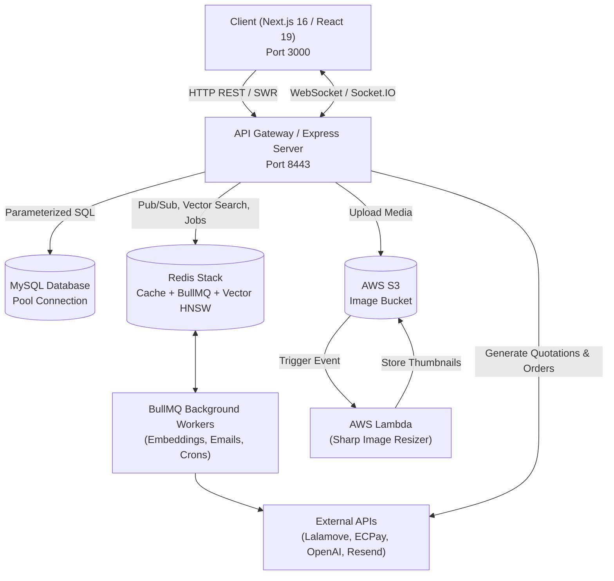

# Onboarding Guide: Megaweave

## Overview
**Megaweave** is a community-driven resource-sharing platform originally created as a Facebook group and now transformed into a searchable, full-stack web application. It connects communities and individuals to facilitate the free and sustainable circulation of idle goods, featuring an AI-assisted recommendation feed, real-time messaging, logistics dispatch via Lalamove, and payment processing via ECPay.

---

## Tech Stack

| Layer | Technology | Key Dependencies / Versions |
|---|---|---|
| **Frontend** | React 19 + Next.js 16 (App Router, Turbopack) | Tailwind CSS, Radix UI, Framer Motion, SWR, Socket.io-client, Sentry |
| **Backend** | Node.js + Express 4 (TypeScript) | `mysql2`, `ioredis`, `@redis/client`, BullMQ, Socket.IO, `express-rate-limit`, Zod |
| **Databases & Cache** | MySQL 8 + Redis Stack | RediSearch & Vector Similarity Search (HNSW index: `idx:posts_v`) |
| **Background Jobs** | BullMQ + Redis | Image processing, OpenAI embeddings, transactional emails, delivery reconciliation |
| **Serverless Services** | AWS Lambda | `image-resizer` (Sharp + S3 event trigger) |
| **External APIs** | Logistics & Payments | Lalamove API (instant quotes & dispatch), ECPay (AIO payment gateway), Resend, OpenAI |
| **DevOps & CI/CD** | Docker Compose + GitHub Actions | Multi-stage Dockerfiles, self-hosted EC2 deployment runner |

---

## Architecture



---

## Key Entry Points

- **Root Task Runner**: `Makefile` — central commands for installing, developing, testing, building, and running Redis.
- **Server Entry Point**: `server/src/server.ts` — Express bootstrap, Redis connection, vector index initialization, BullMQ workers, and Socket.IO adapter.
- **Server API Router**: `server/src/api.ts` — aggregation point for all REST endpoints (`/api/posts`, `/api/lalamove`, `/api/payments`, etc.).
- **Client Root / App Shell**: `client/app/layout.tsx` — global context providers (User, Socket, Notification, Location).
- **Client Middleware**: `client/middleware.ts` — session cookie inspection and route guarding.
- **Docker Compose Configurations**:
  - Dev: `docker-compose.dev.yml` (Redis Stack with Redis Insight UI on port 8001).
  - Prod: `docker-compose.yml` (Redis, Backend, Frontend, and Workbench).

---

## Directory Map

```
Megaweave/
├── client/                      # Next.js 16 App Router frontend
│   ├── app/                     # App Router pages (feed, item, delivery, profile, chat)
│   ├── components/              # UI components (Radix UI wrappers, cards, modals)
│   ├── contexts/                # React Contexts (Socket, Notification, Auth, etc.)
│   ├── hooks/                   # Custom client-side React hooks
│   ├── services/                # Client-side API fetchers
│   └── utils/                   # Client formatting, image processing, and algorithms
├── server/                      # Node.js + Express backend
│   └── src/
│       ├── api.ts               # Master router registry
│       ├── queue/               # BullMQ connection, queues, and worker jobs
│       ├── services/            # Business services (post, feed recommendation, Lalamove, ECPay)
│       ├── utils/               # MySQL pool, Redis client, Socket.IO, S3 helpers
│       ├── middleware/          # Authentication & validation middleware
│       └── server.ts            # Server bootstrapper and lifecycle hooks
├── services/
│   └── image-resizer/           # AWS Lambda function for generating WebP thumbnails via Sharp
├── docs/                        # Architecture documentation, ADRs, and agent rules
├── Makefile                     # Developer command runner
└── CLAUDE.md                    # Agent & developer project instructions
```

---

## Request Lifecycle

Tracing a post creation request (`POST /api/posts`):

1. **Routing & Rate Limiting**: Request enters `server/src/server.ts` where `express-rate-limit` validates IP quotas, then forwards through `server/src/api.ts` to `server/src/posts.ts`.
2. **Authentication & Validation**: `requireAuth` extracts session cookies; Zod schemas validate the request payload (title, condition, location, categories).
3. **Business Logic & Transaction**: `postService.ts` opens a MySQL transaction via `dbPool.getConnection()`, assigns a UUID v4 `public_id`, creates the post record, and updates location entries.
4. **Asynchronous Job Enqueueing**:
   - Post images are scheduled in BullMQ's `postImageQueue` for S3 upload.
   - Post content is queued in `postEmbeddingQueue` to generate 1536-dimensional vector embeddings via OpenAI.
5. **Vector Indexing & Cache Invalidation**: The worker calculates cosine embeddings, saves them into Redis Stack's HNSW vector index (`idx:posts_v`), and triggers hot score recalculation.
6. **Response & Live Broadcast**: The HTTP response returns `201 Created` with the post payload; Socket.IO broadcasts update events to connected clients.

---

## Conventions

- **Commit Style**: Conventional Commits format (`feat(...)`, `fix(...)`, `refactor(...)`, `perf(...)`, `chore(...)`).
- **Data Access**: Use `mysql2/promise` with parameterized queries (`?`) and explicit transaction rollbacks.
- **Code Organization**: Controllers in `server/src/` remain lean; domain logic belongs in `server/src/services/`.
- **Heavy Async Processing**: Never block the Express event loop; defer image resizing, embeddings, and email dispatch to BullMQ.
- **Component Design**: UI components use Tailwind CSS and Radix UI primitives; client-side fetching is managed by SWR.

---

## Common Tasks

| Task | Command |
|---|---|
| **Start Redis Stack (Docker)** | `make redis` *(Redis Insight UI accessible at http://localhost:8001)* |
| **Start Backend Dev Server** | `make dev-server` *(or `cd server && npm run dev`)* |
| **Start Frontend Dev Server** | `make dev-client` *(or `cd client && npm run dev`)* |
| **Run All Tests** | `make test` *(or `cd server && npm test`)* |
| **Run TypeScript Typecheck** | `make typecheck` |
| **Lint & Fix Code** | `make lint` / `make lint-fix` |
| **Production Build** | `make build` |

---

## Where to Look

| I want to... | Look at... |
|---|---|
| Add or adjust a REST API endpoint | `server/src/api.ts` & corresponding route file in `server/src/` |
| Modify feed ranking / recommendation | `server/src/services/feedService.ts` & `server/src/services/vectorIndexService.ts` |
| Change ECPay checkout logic | `server/src/services/payment/ecpay/` |
| Change Lalamove dispatch or webhooks | `server/src/services/lalamove.ts` & `server/src/lalamove.ts` |
| Add a background queue job / worker | `server/src/queue/queues.ts` & `server/src/queue/workers.ts` |
| Add a frontend page / route | `client/app/` |
| Add a reusable UI component | `client/components/` |
