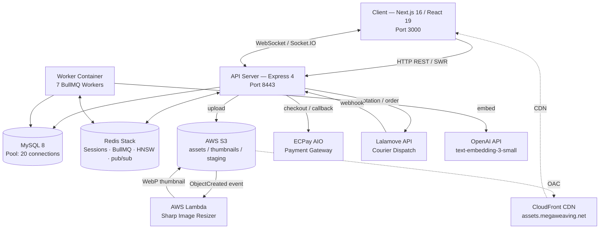

# Megaweave — System Design & Business Logic

> **Purpose:** Three-in-one reference —
> 1. 📄 **Resume roadmap** — where the technical highlights are and what can be strengthened
> 2. 🐛 **Debug index** — which subsystem to suspect when something breaks
> 3. 📈 **Scaling roadmap** — where the bottlenecks are and what horizontal expansion looks like
>
> **Last updated:** 2026-09-16
> **Truth source:** `/Users/zhangjunhao/Desktop/Git-repos/Megaweave` and `/Users/zhangjunhao/Desktop/Git-repos/Megaweaving-infra`

---

## Table of Contents

1. [System Overview](#1-system-overview)
2. [Architecture Diagram](#2-architecture-diagram)
3. [Subsystem Deep Dives](#3-subsystem-deep-dives)
   - [3.1 Personalized Feed & Recommendation Engine](#31-personalized-feed--recommendation-engine)
   - [3.2 User Interest Vector & EMA Write-Back](#32-user-interest-vector--ema-write-back)
   - [3.3 Post Embedding Pipeline](#33-post-embedding-pipeline)
   - [3.4 Hot Score & Trending Feed](#34-hot-score--trending-feed)
   - [3.5 Real-Time Communication (Socket.IO)](#35-real-time-communication-socketio)
   - [3.6 Logistics — Lalamove Integration](#36-logistics--lalamove-integration)
   - [3.7 Payment — ECPay Integration](#37-payment--ecpay-integration)
   - [3.8 BullMQ Background Workers](#38-bullmq-background-workers)
   - [3.9 Cloud Infrastructure (Terraform)](#39-cloud-infrastructure-terraform)
   - [3.10 Auth & Session](#310-auth--session)
   - [3.11 Rate Limiting](#311-rate-limiting)
4. [Scaling Roadmap](#4-scaling-roadmap)
5. [Resume Highlights Summary](#5-resume-highlights-summary)
6. [Known Technical Debt](#6-known-technical-debt)

---

## 1. System Overview

**Megaweaving** (大量交織) is a community-driven item-sharing and free-exchange platform. Originally a Facebook group with 11k+ members, it was rebuilt as a full-stack web application. Users list idle goods (free or for exchange), discover items through a personalized feed, coordinate delivery via Lalamove courier dispatch, and pay delivery fees through ECPay.

**Core user flows:**
- Post an item → upload photos → AI generates embedding → appears in others' feeds
- Browse feed → swipe (Tinder mode) or scroll → user interest vector updates in background
- Request delivery → Lalamove quotation → ECPay payment → real-time GPS tracking

---

## 2. Architecture Diagram



**Tech Stack Summary**

| Layer | Technology |
|-------|-----------|
| Frontend | Next.js 16 (App Router), React 19, Tailwind CSS, Radix UI, Framer Motion, SWR |
| Backend | Express 4, TypeScript, Zod validation |
| Database | MySQL 8 — raw `mysql2` promise pool (no ORM, no migration runner) |
| Cache / Vector | Redis Stack — sessions, BullMQ queues, Socket.IO pub/sub, HNSW index `idx:posts_v` |
| Queue | BullMQ 6 — 7 workers in a separate Docker container |
| Object Storage | AWS S3 (3 buckets) + CloudFront CDN |
| Serverless | AWS Lambda (Sharp) — event-driven image resizing |
| Infra as Code | Terraform — CloudFront, S3, ACM, Route 53, Lambda, IAM |
| Payment | ECPay AIO (Taiwan) |
| Logistics | Lalamove API (HMAC auth) |
| AI | OpenAI `text-embedding-3-small` (1536-dim) |
| Monitoring | Sentry (client + server), structured console logs |

---

## 3. Subsystem Deep Dives

---

### 3.1 Personalized Feed & Recommendation Engine

**Files:** `server/src/services/feedService.ts`, `server/src/services/vectorIndexService.ts`

#### What it does
Serves ranked item feeds to users. The ranking combines semantic similarity to the user's interest vector with item popularity (hot score) and geographic proximity.

#### Four-path routing (`feedService.getFeed`)

```
Request: GET /api/posts/feed?mode=tinder&lat=25.04&lng=121.53

if (tinder mode OR hasFilters)
  → getFilteredFeed(params, userVector)     ← hybrid re-rank; works with or without vector
else if (userVector exists)
  → getPersonalizedFeed(userVector, params) ← full HNSW KNN personalization
else if (lat/lng present, no vector)
  → getFilteredFeed(params, null)           ← geo-proximity only, no personalization
else
  → getTrendingFeed()                       ← Redis ZSET cold-start fallback
```

#### Late Materialization pattern

```
Stage 1 — Lightweight candidate retrieval
  SELECT id, hot_score, lat, lng FROM posts WHERE {filters}
  ORDER BY hot_score DESC LIMIT {CANDIDATE_FETCH_LIMIT}
  ← no JOIN to images, users, categories; no embedding column

Stage 2 — In-memory re-ranking
  For each candidate:
    postVec = memoryCache.get(id) || Redis HGET post:{id}
    similarity = cosineSimilarity(userVec, postVec)
    FinalScore = 0.7 * similarity + 0.3 * (hotScore / maxHotScore)
    FinalScore *= geoMultiplier(distKm)  // 5km→×1.2, 15km→×1.1
    if not expired: FinalScore += 10.0   // priority boost for active items
  sort descending by FinalScore, slice current page

Stage 3 — Full hydration (current page only)
  SELECT p.*, u.*, up.*, c.*, cond.*, l.*, GROUP_CONCAT(i.s3_key)
  FROM posts p
  LEFT JOIN users u, user_profiles up, categories c,
            conditions cond, locations l, images i
  WHERE p.id IN ({pageIds})
  ← only N rows (e.g. 12) get the expensive 6-table JOIN
```

#### Caching layers

| Cache | Location | Capacity / TTL | Purpose |
|-------|----------|----------------|---------|
| `postVectorMemoryCache` | Node.js process memory | 2000 entries, no TTL | Post embeddings don't change; avoid repeated Redis reads |
| `userVectorMemoryCache` | Node.js process memory | Per user, 5-min TTL | User vectors change; TTL balances freshness vs Redis load |
| Redis `user:{id}:vector` | Redis Stack | No expiry | Source of truth for user interest vector |
| Redis `feed:trending` ZSET | Redis Stack | Refreshed every 15 min by hot-score cron | Pre-sorted post IDs for cold-start feed |

#### HNSW Vector Index

- **Index name:** `idx:posts_v`
- **DIM:** 1536 (OpenAI `text-embedding-3-small`)
- **Distance metric:** COSINE
- **Key format:** `post:{id}` with field `v` (FLOAT32 LE binary)
- **Cold-start recovery:** On server start, `ensureVectorIndexExists()` checks if `num_docs` in index matches MySQL count. If Redis was flushed, auto-runs `syncVectorsFromMySQL()` with a distributed lock to prevent multi-replica duplicate sync.

#### 🏆 Resume highlights
- Four-path adaptive routing with graceful cross-path fallback
- Late materialization: defers 6-table JOIN to current page slice only
- Two-layer in-memory vector cache (post vectors permanent, user vectors 5-min TTL)
- Hybrid FinalScore formula combining semantic similarity, hot score, and geo boost

#### ⚠️ Scaling blockers
- **Single-process vector cache:** `postVectorMemoryCache` and `userVectorMemoryCache` are Node.js heap maps — not shared across API replicas. Cache misses will go to Redis (fast but not free); inconsistency between replicas is acceptable for this use case.
- **HNSW KNN `k` parameter:** Currently `Math.max(150, (page + 2) * limit)`. Increasing k improves recall quality but increases Redis CPU and Stage 2 memory usage.
- **Late materialization is optimal only when the page slice is small.** If someone requests `limit=50`, Stage 3 becomes expensive.

#### 🐛 Debug signals
| Symptom | Likely cause |
|---------|-------------|
| Feed returns 0 results for logged-in user | User vector missing — check Redis `HGET user:{id}:vector v`; check `user-vector` worker logs |
| Feed identical for everyone | All users getting `getTrendingFeed` → user vectors not being computed; check `post-embedding` and `user-vector` worker queues |
| `Unknown index name` error on startup | Redis was flushed; `vectorIndexService` auto-heals — check logs for `syncVectorsFromMySQL` |
| Geo boost not applying | `lat`/`lng` not passed in request params; check client-side `LocationContext` |

---

### 3.2 User Interest Vector & EMA Write-Back

**Files:** `server/src/queue/jobs/userVector.ts`, `server/src/queue/jobs/userVectorFlush.ts`

#### What it does
Learns user preferences from behavioral signals in real time. Each interaction updates a user's 1536-dim interest vector using Exponential Moving Average (EMA), making the feed increasingly personalized without requiring explicit ratings.

#### EMA update formula

```
V_new = Normalize( (1 - α) * V_old + α * V_post )

α by action strength:
  view    → 0.05  (weak signal; user saw it)
  like    → 0.20  (moderate; user engaged)
  comment → 0.40  (strong; user wrote something)
  weave   → 0.80  (strongest; user wants to exchange/take)
```

The normalization to unit vector ensures cosine similarity comparisons remain valid after blending.

#### Write-back pattern (Redis → MySQL)

```
User performs action (like, comment, weave, view)
  ↓
Route handler enqueues user-vector job
  ↓
user-vector worker (concurrency: 5):
  1. fetchPostVector(postId) — Redis first, MySQL fallback
  2. fetchUserVector(userId) — Redis first, MySQL fallback; zeros if cold-start
  3. EMA blend + normalize
  4. HSET user:{userId}:vector v {buffer} updated_at {ts}   ← immediate
  5. SADD user:vector:dirty {userId}                         ← mark for flush
  ↓ (every 10 minutes)
user-vector-flush cron (concurrency: 1):
  1. SPOP user:vector:dirty 500    ← atomic pop, max 500 at a time
  2. Parallel: read each userId vector from Redis
  3. Single SQL: INSERT INTO user_profiles (user_id, interest_vector, vector_updated_at)
                 VALUES (...) ON DUPLICATE KEY UPDATE interest_vector = VALUES(...)
```

#### Design decisions
- **Redis as source of truth:** Feed reads user vector from Redis (0ms in-memory path), not MySQL. MySQL is for durability only.
- **SPOP is atomic:** Even with multiple worker replicas, each userId is only processed by one flush job (SPOP removes and returns atomically).
- **Batch size 500:** Prevents a single flush from overwhelming MySQL if dirty set accumulates (e.g., after a viral post).

#### 🏆 Resume highlights
- EMA behavioral learning with action-weighted α values
- Redis-first write-back with dirty-set pattern for batch MySQL persistence
- Cold-start handling (zero-vector initialization for new users)

#### ⚠️ Scaling blockers
- **Single flush worker (concurrency: 1):** Correct for data integrity (prevents race on SPOP), but means flush throughput is bounded by one Node.js process. If dirty set grows beyond 500 × flush_interval capacity, vectors lag behind.
- **Flush interval is 10 minutes:** User vector changes don't reflect in feed for up to 10 minutes + 5-min memory cache TTL = up to 15-min lag.

#### 🐛 Debug signals
| Symptom | Likely cause |
|---------|-------------|
| User feed not personalizing despite interactions | `user-vector` worker queue backed up; check BullMQ `user-vector` queue depth |
| `user-vector-flush` logs `skip: dirty set empty` every run | No interactions happening, or dirty set key expired/deleted |
| Dimension mismatch warning in logs | Legacy user vector in MySQL has wrong dim — worker reinitializes to zeros |

---

### 3.3 Post Embedding Pipeline

**Files:** `server/src/queue/jobs/postEmbedding.ts`, `server/src/services/vectorIndexService.ts`

#### Flow

```
POST /api/posts → 201 Created
  ↓ enqueue post-embedding job (BullMQ)
  ↓
post-embedding worker (concurrency: 2):
  1. Build embedding text:
     "{title} {type} {category} {condition} {tags} {city} {province}\n{content}"
     (category & condition names resolved from 24h in-memory dict cache)
  2. OpenAI text-embedding-3-small → 1536-dim float32 vector
  3. HSET post:{postId} v {buffer} post_id {id} status {type}
  4. UPDATE posts SET embedding = {jsonArray} WHERE id = {postId}
     (MySQL as cold-start backup; Redis is the live index)
```

#### Cold-start sync
On server start, if Redis HNSW index has fewer docs than MySQL posts with embeddings, `syncVectorsFromMySQL()` backfills Redis from MySQL in batches of 50 (parallel HSET within each batch). A distributed Redis lock (`vector_index_sync_lock`) prevents multiple API replicas from syncing simultaneously.

#### 🏆 Resume highlights
- Async embedding pipeline decoupled from request path (no latency impact on post creation)
- Dual persistence: Redis (live) + MySQL (cold-start backup)
- Dict cache for category/condition names avoids per-job DB queries

#### ⚠️ Scaling blockers
- **OpenAI rate limits:** Concurrency is set to 2. If post volume spikes (viral event), the embedding queue will back up. Mitigation: increase concurrency, add retry backoff, or switch to batch embedding endpoint.
- **No embedding versioning:** If OpenAI changes the model or we switch models, all vectors need to be regenerated. No version field on the HNSW index or MySQL embedding column.

---

### 3.4 Hot Score & Trending Feed

**Files:** `server/src/queue/jobs/hotScore.ts`

#### Hot score formula

```
engagement = views×1 + likes×5 + comments×8 + weaves×15
score = (engagement + 1) / (ageHours + 2)^1.5

if ageHours ≤ 24: score *= 1.2   ← new item exploration boost
if status ≠ 'active': score = 0
```

This is a variant of the Hacker News gravity formula. The `+1` in the numerator prevents division by zero for new posts; `+2` in the denominator prevents infinite scores at age 0.

#### Update flow (every 15 minutes)

```
hot-score cron (concurrency: 1):
  1. SELECT all non-deleted posts with engagement counts (subquery for comments, weaves)
  2. Calculate score for each post in Node.js
  3. Build temp ZSET key = feed:trending:temp:{timestamp}
  4. ZADD temp key {score member} for all active posts
  5. RENAME temp key → feed:trending  ← atomic swap; no stale members
  6. Batch UPDATE posts SET hot_score = CASE WHEN id=? THEN ? ... (100 rows/batch)
  7. SET hot-score:last-run {timestamp} EX 3600  ← debounce marker
```

The atomic RENAME ensures the trending feed is never partially updated during a read.

#### 🏆 Resume highlights
- Gravity decay formula (Hacker News variant) with new-item exploration boost
- Atomic Redis ZSET swap via temp key RENAME — zero downtime updates

#### ⚠️ Scaling blockers
- **Full table scan every 15 minutes:** `SELECT` fetches all non-deleted posts. As post count grows, this query becomes expensive. Mitigation: add `updated_at > NOW() - INTERVAL 24 HOUR` filter + separate slow-decay refresh for older posts.
- **MySQL batch UPDATE:** 100 rows/batch. For millions of posts, this will be the bottleneck.

---

### 3.5 Real-Time Communication (Socket.IO)

**Files:** `server/src/server.ts`, `server/src/lalamove.ts`, `server/src/queue/jobs/deliveryReconcile.ts`

#### Architecture

```
Client A                   Express + Socket.IO               Client B
   |                             |                              |
   |--- join delivery_{orderId} →|                              |
   |                             |←-- join delivery_{orderId} --|
   |                             |                              |
Lalamove DRIVER_LOCATION_UPDATED webhook
   |                             |
   |         no DB write         |
   |                        emit("delivery_update", {coordinates})
   |←── delivery_update ─────────|──────────────────────────────→|
```

- **Redis pub/sub adapter** (`@socket.io/redis-adapter`): pub client = shared cache Redis; sub client = `.duplicate()` to avoid blocking the pub client. This allows horizontal scaling — multiple API replicas all receive the same events.
- **Room design:**
  - `delivery_{orderId}` — buyer + seller + admin for a specific delivery
  - `user_{userId}` — personal notifications

#### GPS pass-through (no DB write)

When Lalamove sends a `DRIVER_LOCATION_UPDATED` webhook event, the handler skips all DB operations and directly emits to the Socket.IO room:

```typescript
// lalamove.ts L609-625
if (eventType === "DRIVER_LOCATION_UPDATED") {
  io.to(`delivery_${orderId}`).emit("delivery_update", {
    orderId, eventType, coordinates: location,
    updatedAt: new Date().toISOString(),
  });
  res.status(200).json({ received: true });
  return;   // ← exits before any DB query
}
```

This is intentional: driver GPS updates are high-frequency (every few seconds). Writing each to DB would create thousands of writes per active delivery with no meaningful business value (GPS coordinates don't need to be persisted per-ping).

#### 🏆 Resume highlights
- Redis pub/sub adapter enabling horizontal Socket.IO scaling
- GPS pass-through pattern: webhook → Socket.IO room without DB writes
- Reconciliation pushes corrected status back to clients via Socket.IO

#### ⚠️ Scaling blockers
- **Redis pub/sub is the fan-out bottleneck.** If there are thousands of concurrent active deliveries, Redis sub channel traffic increases proportionally. Solution: Redis Cluster or dedicated pub/sub Redis instance.
- **No Socket.IO sticky sessions configured explicitly.** The Redis adapter handles cross-server event delivery, but if load balancer doesn't support sticky sessions, initial handshake reliability depends on Redis adapter working correctly.

#### 🐛 Debug signals
| Symptom | Likely cause |
|---------|-------------|
| Client not receiving GPS updates | Socket.IO room not joined; check client-side `join delivery_{orderId}` call |
| GPS updates delayed | Redis pub/sub lag; check Redis memory and CPU |
| `[socket.io] cors error` | Frontend origin missing from `CORS_ORIGINS` env var |

---

### 3.6 Logistics — Lalamove Integration

**Files:** `server/src/lalamove.ts`, `server/src/services/lalamove.ts`, `server/src/queue/jobs/deliveryReconcile.ts`

#### Order state machine

```
PAYMENT_PENDING
    ↓ (ECPay payment confirmed)
ASSIGNING_DRIVER
    ↓ (Lalamove assigns driver)
ON_GOING
    ↓ (driver picks up)
PICKED_UP
    ↓ (delivered)
COMPLETED

Failure states: CANCELLED | EXPIRED | FAILED
```

#### API flow (happy path)

```
1. GET /api/lalamove/service-types     — list available service types
2. POST /api/lalamove/quotation        — get price estimate from Lalamove
3. POST /api/payments/checkout         — pay via ECPay; creates delivery_order record
4. (ECPay webhook callback)            — payment confirmed; status → ASSIGNING_DRIVER
5. POST /api/lalamove/orders           — create Lalamove order
6. GET /api/lalamove/orders/:orderId   — poll status from local DB (not Lalamove API)
7. GET /api/lalamove/orders/:orderId/driver — get driver details from Lalamove API
```

#### Webhook processing

All Lalamove events POST to `/api/lalamove/webhook`. The handler:
1. Verifies HMAC signature (`Authorization: hmac {key}:{timestamp}:{signature}`)
2. Branches on `eventType`:
   - `DRIVER_LOCATION_UPDATED` → GPS pass-through (no DB)
   - All others → update `delivery_orders` status + driver info → emit Socket.IO

#### Reconciliation job (`deliveryReconcile.ts`, every 5 minutes)

```
Phase 1 — Expire stale PAYMENT_PENDING orders
  SELECT delivery_orders WHERE status='PAYMENT_PENDING' AND expires_at < NOW()
  UPDATE status='EXPIRED', failure_reason='...'
  UPDATE payments SET status='CANCELLED' WHERE payment_id AND status='PENDING'
  INSERT delivery_order_events (audit log)

Phase 2 — Reconcile in-progress orders with missed webhooks
  SELECT delivery_orders
  WHERE status IN ('ASSIGNING_DRIVER','ON_GOING','PICKED_UP')
    AND lalamove_order_id IS NOT NULL
    AND updated_at < NOW() - INTERVAL 3 MINUTE
  LIMIT 30

  For each order:
    await sleep(300ms)   ← rate limit protection
    remoteDetail = getLalamoveOrderDetail(lalamove_order_id)
    if remoteStatus ≠ localStatus OR driver newly assigned:
      UPDATE delivery_orders SET status, driver_name, ...
      INSERT delivery_order_events
      io.emit('RECONCILED_UPDATE', ...)
```

#### 🏆 Resume highlights
- Stateful order reconciliation: polls Lalamove API for stale orders and pushes corrections to clients via Socket.IO
- Two-phase reconciliation: payment expiry (Phase 1) + delivery state recovery (Phase 2)
- Audit trail via `delivery_order_events` table

#### ⚠️ Scaling blockers
- **Reconcile job polls Lalamove API sequentially with 300ms sleep.** For 30 orders per run, that's 9 seconds minimum per cron run. If active deliveries exceed 30 at once, some will be checked less frequently. Solution: increase LIMIT or add concurrency (with rate-limit-aware batching).
- **Single reconcile worker (concurrency: 1).** Safe by design, but limits throughput.

#### 🐛 Debug signals
| Symptom | Likely cause |
|---------|-------------|
| Delivery stuck in ASSIGNING_DRIVER | Lalamove webhook not reaching server; check webhook URL in Lalamove dashboard; reconcile job will auto-fix within 5 min |
| `401 Unauthorized` from Lalamove | HMAC timestamp drift (±60s allowed); verify server NTP sync |
| Order status shows EXPIRED unexpectedly | `expires_at` was set at quotation time; user didn't complete payment in time |

---

### 3.7 Payment — ECPay Integration

**Files:** `server/src/payments.ts`, `server/src/services/payment/ecpay/`

#### Flow

```
1. POST /api/payments/checkout
   → validate delivery_order exists and is in PAYMENT_PENDING
   → generate CheckMacValue (AES-256 + URL encode + MD5)
   → return redirect URL to ECPay hosted checkout page

2. User pays on ECPay → ECPay POSTs to /api/payments/ecpay/callback (S2S)
   → verify CheckMacValue
   → UPDATE payments SET status='PAID'
   → UPDATE delivery_orders SET status='ASSIGNING_DRIVER'
   → emit Socket.IO update

3. GET /api/payments/status/:merchantTradeNo
   → SELECT FROM payments WHERE merchant_trade_no=?
   ← returns local DB status (does NOT call ECPay API)
```

The status endpoint reads from the local DB by design — this avoids client polling hammering the ECPay API and eliminates the need for ECPay API credentials on the status check path.

#### 🐛 Debug signals
| Symptom | Likely cause |
|---------|-------------|
| `CheckMacValue mismatch` | `ECPAY_HASH_KEY` / `ECPAY_HASH_IV` mismatch, or URL encoding difference. Run: `cd server && npx jest src/services/payment/ecpay/__tests__/cmv.test.ts` |
| Payment shows PENDING forever | ECPay callback webhook not reaching `/api/payments/ecpay/callback`; check ngrok/reverse proxy in dev |
| Payment PAID but delivery still PAYMENT_PENDING | Callback handler failed to update `delivery_orders`; check server logs at callback time |

---

### 3.8 BullMQ Background Workers

**Files:** `server/src/queue/workers.ts`, `server/src/queue/queues.ts`, `server/src/queue/jobs/`

#### Worker inventory

| Worker | Concurrency | Trigger | Retries | Key behavior |
|--------|-------------|---------|---------|--------------|
| `post-image` | 1 | Post create/delete | 5, exp backoff | S3 PutObject / DeleteObject via multer-s3 |
| `email` | 1 | Business events | 3 | Resend + react-email server-side rendering |
| `post-embedding` | 2 | Post create | 3 | OpenAI text-embedding-3-small → Redis + MySQL |
| `user-vector` | 5 | User behavior | 3 | EMA blend → Redis; mark dirty |
| `user-vector-flush` | 1 | Cron 10 min | 1 | SPOP dirty set → batch INSERT MySQL |
| `hot-score` | 1 | Cron 15 min | 1 | Full-table score recalc → Redis ZSET + MySQL |
| `delivery-reconcile` | 1 | Cron 5 min | 1 | Lalamove API poll + Socket.IO correction |

#### Container separation

In production, API and workers run in **separate Docker containers**:

```
docker-compose.yml
  backend:   APP_ROLE=api     → server.ts (Express + Socket.IO, no workers)
  worker:    APP_ROLE=worker  → worker.ts (BullMQ workers only)
```

Both containers share the same Redis instance — BullMQ uses Redis as the job queue transport. This allows independent scaling: scale API replicas for request throughput, scale worker replicas for embedding/job throughput.

> [!NOTE]
> `RUN_WORKERS_INLINE=true` env var is also supported for single-container development setups. This starts workers inside the API process.

#### 🏆 Resume highlights
- API/worker container separation enabling independent scaling
- 7 purpose-specific workers with distinct concurrency settings tuned to each job type
- Cron jobs managed within BullMQ (repeatable jobs), not system cron — portable and observable

#### ⚠️ Scaling blockers
- **Workers share Redis with API.** High embedding throughput could starve BullMQ queue operations or session lookups. Solution: dedicated Redis instance for vector operations vs cache/session.
- **No worker auto-scaling.** Worker replica count is static in `docker-compose.yml`. For truly elastic scaling, migrate to ECS/Kubernetes with KEDA queue-depth autoscaler.

---

### 3.9 Cloud Infrastructure (Terraform)

**Repo:** `Megaweaving-infra` · **Region:** `ap-east-2` (main), `us-east-1` (ACM only)

#### What Terraform manages

| Resource | Details |
|----------|---------|
| S3 `assets` bucket | Source media; OAC-only access (no public) |
| S3 `thumbnails` bucket | WebP output from Lambda; OAC-only |
| S3 `staging` bucket | Pre-upload temp storage; 1-day lifecycle expiry |
| CloudFront distribution | Dual origin (assets + thumbnails); HTTP→HTTPS redirect; custom domain |
| ACM certificate | `assets.megaweaving.net`; DNS validation via Route 53 record |
| Route 53 records | Cert validation CNAME + CloudFront alias A record |
| Lambda `image-resizer` | Sharp layer (Node 22.x); S3 ObjectCreated trigger |
| IAM user + policy | `megaweaving-app-s3-user` with least-privilege S3 access |
| Terraform state | S3 backend (`ap-east-2`) + lockfile |

#### What is NOT in Terraform
- EC2 instance (manually provisioned)
- Route 53 hosted zone itself (pre-existing)
- Full DNS record set (only cert validation + assets alias)

#### Image resizing pipeline

```
Upload: POST /api/posts (multipart) → multer-s3 → assets S3 bucket
                                                        ↓ ObjectCreated event
                                                   Lambda (Sharp)
                                                        ↓
                                           thumbnails S3 bucket
                                           (300px thumb, 800px medium, WebP)
                                                        ↓ OAC
                                               CloudFront CDN
                                                        ↓
                                           Client: assets.megaweaving.net/...
```

#### ⚠️ Scaling blockers
- **EC2 is not IaC-managed.** Server configuration lives in the operator's head, not in code. Any EC2 rebuild would require manual re-setup. Solution: add EC2/ECS Terraform module or switch to containerized deployment on ECS Fargate.
- **Lambda image resizer is synchronous per object.** For bulk post imports, Lambda concurrency limit could become a bottleneck.

---

### 3.10 Auth & Session

**Files:** `server/src/session.ts`, `server/src/middleware/auth.ts`

#### Session design

```
Login:
  1. Validate credentials / Google OAuth
  2. sessionId = crypto.randomBytes(512).toString('hex')  ← 1024-char hex
  3. SETEX session:{sessionId} 604800 {userJson}          ← 7-day TTL
  4. Set-Cookie: session-id={sessionId}; httpOnly; secure; sameSite=lax
  5. Set-Cookie: user-role={role}; httpOnly=false          ← Edge Runtime readable

Request auth:
  1. requireAuth middleware reads session-id cookie
  2. GETEX session:{sessionId} from Redis
  3. Zod parse → attach req.user: UserSession
  4. Role check (if requireRole used): compares req.user.role from Redis session
     (client-side user-role cookie is for UI routing only; server ignores it for auth)
```

#### 🐛 Debug signals
| Symptom | Likely cause |
|---------|-------------|
| All requests returning 401 | Redis down or REDIS_URL misconfigured |
| User role appears correct in UI but gets 403 | `user-role` cookie out of sync with Redis session; force re-login |

---

### 3.11 Rate Limiting

**Files:** `server/src/middleware/rateLimiter.ts`

#### Tiers

| Limiter | Window | Limit | Applies to |
|---------|--------|-------|-----------|
| `globalRateLimiter` | 1 min | 120 req | All routes |
| `authBurstLimiter` | 10 sec | 5 req | `/api/auth/*`, `/api/signup/*` |
| `authSustainedLimiter` | 1 min | 10 req | Same auth routes |

Auth routes use both burst + sustained limiters in series (tiered).

#### ResilientRedisStore
Custom `Store` implementation that wraps `RedisStore` with a `MemoryStore` fallback. If Redis is unavailable or any Redis operation throws, the middleware silently falls back to in-process memory — requests are never rejected with a 500 due to rate limiter Redis failure.

---

## 4. Scaling Roadmap

| Bottleneck | Current state | Impact | Suggested fix | Effort |
|-----------|--------------|--------|--------------|--------|
| EC2 single instance | One VM, manual setup | Total outage risk | ECS Fargate + ALB | Large |
| MySQL single node | No replication | Read-write contention at scale | Read replica for feed queries | Medium |
| Redis single instance | Session + vector + queue + pub/sub all on one Redis | Redis becomes SPOF and bandwidth bottleneck | Separate Redis instances by role | Medium |
| Worker auto-scaling | Static replica count | Queue backs up during spikes | KEDA + ECS or k8s | Large |
| EC2 not in Terraform | Manual infra | Rebuild risk | Add EC2/ECS Terraform module | Small-Medium |
| No DB migration runner | Raw SQL only | Schema drift in team environments | Add Flyway or Prisma Migrate | Small |
| Hot-score full table scan | Every 15 min, all posts | Grows O(n) with post count | Incremental update for recently active posts only | Medium |
| `postVectorMemoryCache` not shared | Per-replica heap | Cache warm-up on new replica deployment | External cache (Redis) for hot post vectors | Small |

---

## 5. Resume Highlights Summary

| Highlight | Where in code | Claim |
|-----------|--------------|-------|
| Four-path adaptive feed routing | `feedService.getFeed` | Designed recommendation routing with HNSW recall, hybrid re-ranking, geo-proximity, and cold-start fallback |
| Late materialization | `getFilteredFeed`, `getPersonalizedFeed` Stage 3 | Deferred 6-table JOIN hydration to current page slice only |
| EMA user vector + write-back | `userVector.ts`, `userVectorFlush.ts` | Online user preference learning via EMA; Redis write-back with dirty-set flush pattern |
| GPS webhook pass-through | `lalamove.ts` L609-625 | High-frequency driver location pushed to Socket.IO rooms without DB writes |
| Delivery reconciliation | `deliveryReconcile.ts` | Two-phase background job: payment expiry + Lalamove state sync with Socket.IO correction push |
| Full IaC with Terraform | `Megaweaving-infra` repo | CloudFront, S3×3, ACM, Route 53, Lambda, IAM all managed as code |
| API/worker container separation | `docker-compose.yml`, `APP_ROLE` | Independent scaling of API and 7 BullMQ workers |
| Redis pub/sub Socket.IO adapter | `server.ts` | Horizontal Socket.IO scaling across replicas |
| ResilientRedisStore | `rateLimiter.ts` | Rate limiter with Redis-down fallback to in-memory store |

---

## 6. Known Technical Debt

| Item | Location | Impact | Suggested fix |
|------|----------|--------|--------------|
| No DB migration runner | All MySQL schema | Schema can't be bootstrapped from code; new dev setup requires manual DB import | Add Flyway or Prisma Migrate |
| EC2 not in Terraform | Manual | Server rebuild requires manual re-setup; single point of failure | Add EC2 or ECS Fargate Terraform module |
| No `.env.example` | Root | Setup friction for new developers | Generate from env tables in onboarding doc |
| No client-side test runner | `client/` | React component regressions undetected | Add Vitest + Testing Library |
| `client/middleware.ts` partially bypassed | L6: early return | Route protection relies entirely on server-side `requireAuth` | Implement role-based route guard in Next.js middleware |
| No embedding model versioning | `idx:posts_v`, `posts.embedding` | Model change requires full re-embedding run with no rollback path | Add `embedding_model` column to posts; version the HNSW index |
| Hot-score full-table scan | `hotScore.ts` | O(n) with post count; will slow as platform grows | Incremental update: only score posts active in last 24h each cron run |
| Lalamove reconcile sequential with sleep(300ms) | `deliveryReconcile.ts` | Max 30 orders checked per 5-min run | Increase LIMIT; add parallel batching with rate-limit awareness |
